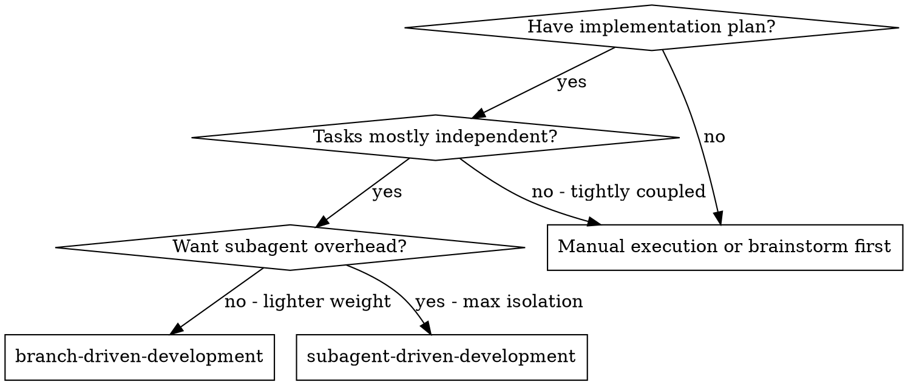
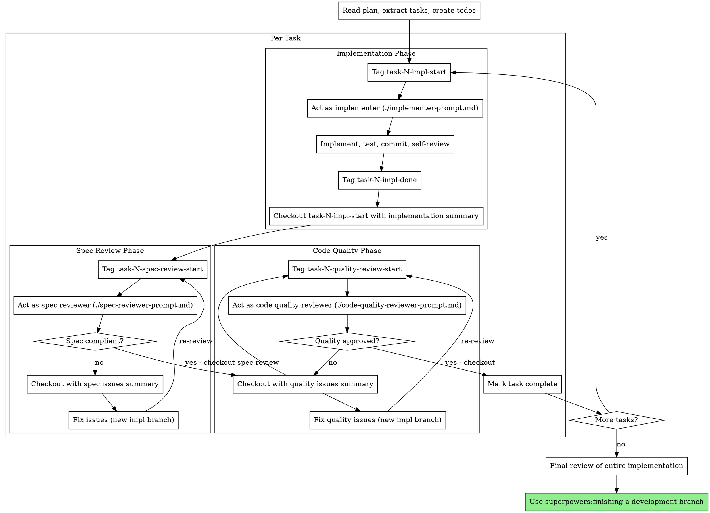

# Branch-Driven Development

Execute a plan by **role-switching with context isolation**. For each task, act as implementer, spec reviewer, and code quality reviewer — but wrap each role in a `context_tag` → work → `context_checkout` cycle so each role starts fresh with only a summary of previous work.

**Core principle:** Context branching per role + two-stage review = subagent-quality isolation without subagent overhead

## When to Use



**vs. Subagent-Driven Development:**
- Same two-stage review model (spec compliance → code quality)
- Context isolation via branching instead of subagents
- Lower cost (no subagent invocations)
- Faster (no subagent startup overhead)
- Slightly less isolation (same model, just context-managed)

**vs. Manual execution:**
- Context doesn't accumulate across roles
- Each reviewer starts fresh (no anchoring to implementer's perspective)
- Structured quality gates still enforced

## Prerequisites

**Before starting, the user must run `/acm` in pi** to enable Agentic Context Management from the pi-context extension. Without it, `context_checkout` will fail.

If `context_checkout` returns an error saying "Agentic context management is not enabled", ask the user to run `/acm` and retry.

## The Process



## The Context Branching Pattern

Each role follows this cycle:

```
context_tag("task-N-{role}-start")
  ↓
  [Do the work as that role]
  ↓
context_checkout(
  target: "task-N-{role}-start",
  message: "[Detailed summary of work/findings]",
  backupTag: "task-N-{role}-raw"
)
```

This means:
- The **implementer's** raw work (file reads, debugging, iteration) is squashed to a summary
- The **spec reviewer** sees only the summary + reads actual code (no implementer bias)
- The **code quality reviewer** sees only summaries + reads actual code (fresh eyes)

### Checkout Message Templates

Each checkout message must include enough detail for the next role to work independently.

**After implementation:**
```
Implemented Task N: [name].
Files changed: [list with brief descriptions]
Tests: [count] passing, [count] failing
Git commits: [SHAs]
Self-review findings: [any issues found and fixed]
Remaining concerns: [anything uncertain]
Next Step: Spec review — verify implementation matches requirements.
```

**After spec review:**
```
Spec review for Task N: [name].
Verdict: ✅ Compliant / ❌ Issues found
[If issues]: Missing: [list]. Extra: [list]. Misunderstood: [list].
[If compliant]: All requirements verified against code.
Next Step: [Code quality review / Fix issues].
```

**After code quality review:**
```
Code quality review for Task N: [name].
Verdict: ✅ Approved / ❌ Issues found
Strengths: [list]
Issues: [Critical/Important/Minor with file:line refs]
Next Step: [Mark complete / Fix issues].
```

## Detailed Per-Task Walkthrough

### Step 1: Implementation

```javascript
// 1. Tag before implementation
context_tag({ name: "task-1-impl-start" });

// 2. Act as implementer following ./implementer-prompt.md
//    - Read the task requirements
//    - Implement exactly what's specified
//    - Write tests, verify they pass
//    - Commit work
//    - Self-review

// 3. Squash implementation context
context_checkout({
  target: "task-1-impl-start",
  message: "Implemented Task 1: [name]. Files: [list]. Tests: 8/8 passing. Committed as [SHA]. Self-review: fixed naming in helper. Next Step: Spec review.",
  backupTag: "task-1-impl-raw"
});
```

### Step 2: Spec Review

```javascript
// 4. Tag before spec review
context_tag({ name: "task-1-spec-review-start" });

// 5. Act as spec reviewer following ./spec-reviewer-prompt.md
//    - Read the task requirements (from plan)
//    - Read the ACTUAL CODE (don't trust the summary)
//    - Compare requirements vs implementation line by line
//    - Check for missing, extra, or misunderstood requirements

// 6. Squash spec review context
context_checkout({
  target: "task-1-spec-review-start",
  message: "Spec review Task 1: ✅ All requirements met. Verified: [list of requirements checked]. Next Step: Code quality review.",
  backupTag: "task-1-spec-review-raw"
});
```

**If spec issues found:**
```javascript
// Checkout with issues
context_checkout({
  target: "task-1-spec-review-start",
  message: "Spec review Task 1: ❌ Missing: progress reporting (spec says every 100 items). Extra: --json flag not requested. Next Step: Fix spec issues.",
  backupTag: "task-1-spec-review-raw"
});

// Fix issues (new implementation branch)
context_tag({ name: "task-1-fix-start" });
// ... fix the issues, commit ...
context_checkout({
  target: "task-1-fix-start",
  message: "Fixed spec issues: Added progress reporting every 100 items, removed --json flag. Tests: 9/9 passing. Next Step: Re-run spec review.",
  backupTag: "task-1-fix-raw"
});

// Re-review (back to step 4)
```

### Step 3: Code Quality Review

```javascript
// 7. Tag before quality review
context_tag({ name: "task-1-quality-start" });

// 8. Act as code quality reviewer following ./code-quality-reviewer-prompt.md
//    - Read the actual code changes
//    - Review for quality, maintainability, testing
//    - Check naming, patterns, error handling

// 9. Squash quality review context
context_checkout({
  target: "task-1-quality-start",
  message: "Quality review Task 1: ✅ Approved. Clean code, good test coverage, follows codebase patterns. Next Step: Mark task complete, proceed to Task 2.",
  backupTag: "task-1-quality-raw"
});

// 10. Mark complete
todo_toggle({ index: 1 });
```

## Example Workflow

```
You: Executing plan with Branch-Driven Development.

[Read plan, extract 3 tasks, create todos]

═══ Task 1: Authentication middleware ═══

[context_tag: task-1-impl-start]

Implementation phase:
- Read requirements from plan
- Implemented JWT validation middleware
- Added 6 tests, all passing
- Self-review: renamed `check` → `validateToken` for clarity
- Committed as abc1234

[context_checkout → task-1-impl-start, summary of implementation]

Spec review phase:
[context_tag: task-1-spec-review-start]

- Read requirements from plan
- Read actual code in auth/middleware.ts
- ✅ All 4 requirements implemented correctly
- No extra features added

[context_checkout → task-1-spec-review-start, "✅ Spec compliant"]

Code quality review phase:
[context_tag: task-1-quality-start]

- Read auth/middleware.ts
- Strengths: Clean, well-tested
- Issue (Minor): Magic number for token expiry
- Overall: Approved with minor suggestion

[context_checkout → task-1-quality-start, "✅ Approved, minor: extract TOKEN_EXPIRY constant"]

Quick fix for minor issue:
[context_tag: task-1-minor-fix]
- Extracted TOKEN_EXPIRY constant
- Committed
[context_checkout → task-1-minor-fix, "Fixed minor issue"]

[Mark Task 1 complete ✅]

═══ Task 2: Rate limiting ═══
[context_tag: task-2-impl-start]
...
```

## Advantages

**vs. Subagent-Driven Development:**
- No subagent startup cost
- No subagent token overhead (system prompts, tool definitions)
- Faster iteration loops
- Same quality gates (spec + quality review)
- Context isolation via branching (lighter but effective)

**vs. Manual execution:**
- Each role starts with clean context (no anchoring bias)
- Structured review gates prevent shipping bad code
- Summaries force explicit handoff (nothing implicit)

**Context efficiency:**
- Implementation noise (file reads, debugging) squashed after each phase
- Only summaries + fresh code reads carry forward
- Context stays lean even across many tasks

## Red Flags

**Never:**
- Skip the checkout between roles (defeats the purpose)
- Write vague checkout messages ("Done", "Implemented it")
- Trust the implementation summary during spec review (read actual code)
- Skip spec review before code quality review (wrong order)
- Proceed with unfixed issues from either review
- Skip the re-review loop after fixes
- Start on main/master without explicit user consent

**If spec review finds issues:**
- Checkout with detailed issue list
- Fix issues in a new tagged branch
- Re-run spec review (don't skip)

**If quality review finds issues:**
- Checkout with detailed issue list
- Fix issues in a new tagged branch
- Re-run quality review (don't skip)

**Context hygiene:**
- Always use `backupTag` on checkouts (lossless squashing)
- Tag names must be semantic (task-N-{role}-{phase})
- Checkout messages must include: what happened, files changed, next step

## Integration

**Required workflow skills:**
- **superpowers:context-management** - The branching mechanism this skill builds on
- **superpowers:using-git-worktrees** - REQUIRED: Set up isolated workspace before starting
- **superpowers:writing-plans** - Creates the plan this skill executes
- **superpowers:finishing-a-development-branch** - Complete development after all tasks

**You should also use:**
- **superpowers:test-driven-development** - Follow TDD during implementation phases

**Alternative workflows:**
- **superpowers:subagent-driven-development** - Use for maximum isolation (separate subagents per role)
- **superpowers:executing-plans** - Use for parallel session execution
